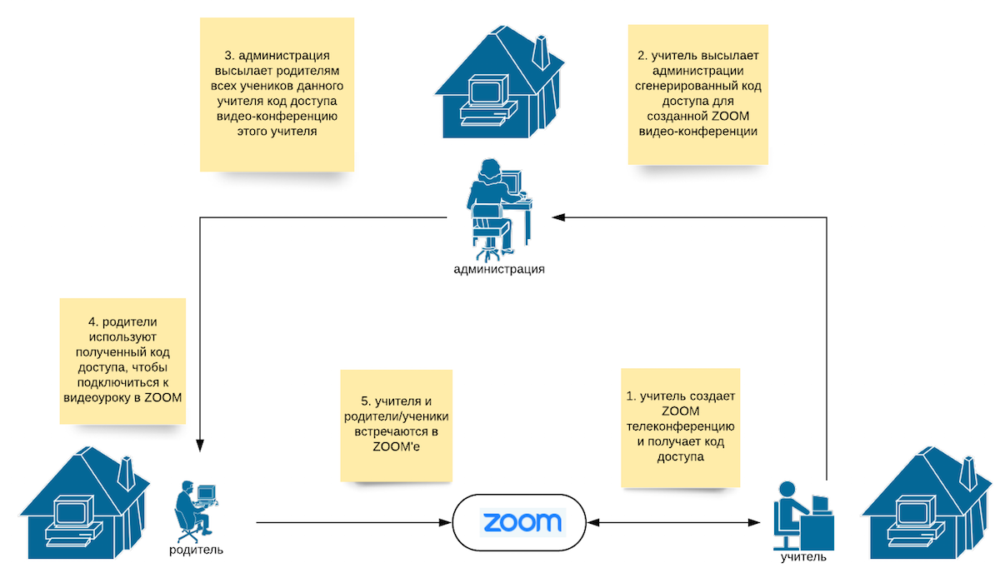

# Кембриджская русская школа: Coronavirus (COVID-19)

<!--
## Краткий обзор ситуации (21:23, 13 марта 2020)
Кембриджская русская школа это школа выходного дня. Обучение в Школе происходит по субботам и предполагает посещение занятий в школе (форма обучения очная). Школа посещается взрослыми и детьми.

12 марта 2020 Всемирная Организация Здравоохранения объявила эпидемию коронавируса (COVID-19) глобальной пандемией. Ситуация в различных странах меняется непрерывно и меры принимаемые правительствами, органами самоуправления и здравоохранения неодинаковы. В настоящее время, Британское правительство не считает эффективным прекращение занятий в учебных заведениях страны (включая детские школы) и их закрытие, при этом не исключает, что такая мера может быть применена в последующие недели и/или месяцы. Некоторые университеты принимают решение о временном переходе на дистанционную форму обучения, но делают это автономно.
-->

## Функционирование Русской Школы в период с 14 марта по 4 апреля 2020 г.
Совет попечителей и администрация Кембриджской Русской Школы следят за развивающейся ситуацией, связанной с эпидемией коронавируса (COVID-19). Официальная позиция школы, а также стратегия работы и планирования следующие: 

 * Школа продолжит свое нормальное функционирование и предоставление уроков с их очным посещением по своему официальному адресу (Long Road Sixth Form College, Long Road, Cambridge, CB2 8PX) до тех пор пока не случится по меньшей мере одно из следующих событий:

  1. Правительство страны или региональная администрация приказывает закрыть все школы в стране или регионе.
  2. Long Road Sixth Form College прекращает доступ к своим помещениям по причине, связанной с эпидемиологической обстановкой.
  3. Среди учеников, родителей или сотрудников есть официально подтвержденный случай заражения коронавирусом.
 * В течение всего времени функционирования Школы в нормальном режиме с предоставлением очной формы обучения, решение о непосещении занятий не влечет перерасчета оплаты за обучение.
 * В случае, если функционирование Школы в нормальном режиме с предоставлением очной формы обучения окажется временно невозможным, Школа обеспечит непрерывность обучения и продолжит занятия в режиме дистанционного обучения по тем урокам где это представляется администрации Школы возможным. Выбор таких уроков будет сделан администрацией и учителями совместно, а полный список будет своевременно опубликован. График таких уроков будет регламентироваться настоящим школьным расписанием, а списки классов останутся неизменными. Решение о непосещении предоставляемых Школой online-уроков не влечет перерасчета оплаты за обучение.
 * Деньги за оплаченные уроки, которые не представляется возможным провести дистанционным способом будут переведены в счет следующего семестра.
 * В случае временного и вынужденного перехода на дистанционное обучение, Школа будет пользоваться платформой для проведения online конференций [ZOOM](https://zoom.us/). Для того, чтобы воспользоваться этой платформой, учителям необходимо зарегистрироваться на сайте [https://zoom.us/](https://zoom.us/) и установить Zoom на домашнем компьютере; родителям же регистрация необязательна, а необходимо лишь установить Zoom на домашнем компьютере.
 
## Учителя, родители и администрация: готовность к online занятиям

Online уроки в Русской Школе будут организованы согласно следующей схеме:

<!--  -->

Для успешного использования этой схемы необходима следующая подготовка ([подробные инструкции здесь](https://github.com/mathmusci/camrusschool-covid-19-contingency/blob/master/zoom-edmodo-instructions.md)).

Администрация Школы **заранее**

 * совместно с учителями, определяет список и график online уроков
 * публикует список и график online уроков и уведомляет о них родителей и учителей 
 
Учителя **заранее (не позднее 18 марта)**

 * устанавливают ZOOM на своем домашнем компьютере
 * создают **одну** видео-конференцию в ZOOM'e - эта видео-конференция будет использоваться как online "кабинет учителя"
 * высылают администрации коды доступа (и, возможно, пароли) к своим ZOOM видео-конференциям (один учитель - одна видео-конференция, один код доступа и один пароль!)

[Более подробные инструкции здесь.](https://github.com/mathmusci/camrusschool-covid-19-contingency/blob/master/zoom-edmodo-instructions.md)

Родители

 * заранее (не позднее 19 марта) устанавливают ZOOM на своем домашнем компьютере
 * используют полученные коды доступа, чтобы подсоединиться к видео-урокам в день занятий

[Более подробные инструкции здесь.](https://github.com/mathmusci/camrusschool-covid-19-contingency/blob/master/zoom-edmodo-instructions.md)

**Как только принимается решение о переводе школы в online-режим администрация**
 * **уведомляет об этом родителей и учителей**
 * **рассылает полученные от учителей коды доступа с паролями родителям (родители затем сами находят нужный код доступа с паролем напротив имени учителя)**

# Полезные ссылки
 * [Coronavirus (COVID-19): UK government response](https://www.gov.uk/government/topical-events/coronavirus-covid-19-uk-government-response)
 * [NHS Medical guidance on Coronavirus (COVID-19): information for the general public](https://www.nhs.uk/conditions/coronavirus-covid-19/)
 * [COVID-19: travel guidance for the education sector (Department for Education and Public Health England)](https://www.gov.uk/government/publications/guidance-to-educational-settings-about-covid-19/covid-19-travel-guidance-for-the-education-sector)
 * [Epidemic calculator](http://gabgoh.github.io/COVID/)
 * [Dashboard showing reported cases of coronavirus in the UK, including new cases, cases by upper tier local authority in England and number of deaths](https://www.gov.uk/government/publications/covid-19-track-coronavirus-cases)
 * [Scheduling meetings in ZOOM](https://support.zoom.us/hc/en-us/articles/201362413-Scheduling-meetings)
 * [How to use ZOOM for online learning](https://blog.zoom.us/wordpress/2020/03/13/how-to-use-zoom-for-online-learning/)