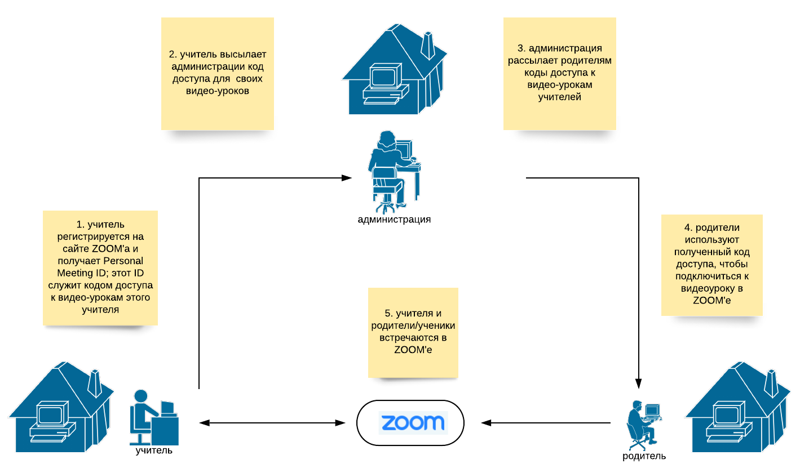

# Кембриджская русская школа: Coronavirus (COVID-19)

## Краткий обзор ситуации (15:32, 13 марта 2020)
Кембриджская русская школа это школа выходного дня. Обучение в Школе происходит по субботам и предполагает посещение занятий в школе (форма обучения очная). Школа посещается взрослыми и детьми.

12 марта 2020 Всемирная Организация Здравоохранения объявила эпидемию коронавируса (COVID-19) глобальной пандемией. Ситуация в различных странах меняется непрерывно, а меры принимаемые правительствами, органами самоуправления и здравоохранения неодинаковы. В настоящее время, Британское правительство не считает эффективным прекращение занятий в учебных заведениях страны (включая детские школы) и их закрытие, при этом не исключает, что такая мера может быть применена в последующие недели и/или месяцы. Некоторые университеты принимают решение о временном переходе на дистанционную форму обучения, но делают это автономно.

## Функционирование Русской Школы в период с 14 марта по 4 апреля 2020 г.
Совет попечителей и администрация Кембриджской Русской Школы следят за развивающейся ситуацией, связанной с эпидемией коронавируса (COVID-19). Официальная позиция школы, а также стратегия работы и планирования следующие:

* Школа продолжит свое нормальное функционирование и предоставление уроков с их очным посещением по своему оффициальному адресу (Long Road Sixth Form College, Long Road, Cambridge, CB2 8PX) до тех пор пока не случится по меньшей мере одно из следующих событий:

  1. Правительство страны или региональная администрация приказывает закрыть все школы в стране или регионе.
  2. Long Road Sixth Form College не может более предоставлять свои помещения Русской Школе.
  3. Среди учеников или родителей есть **оффициально подтвержденый** случай заражения коронавирусом.
  4. Администрация школы физически ограничены и не могут продолжать организацию эффективного и безопасного обучения в очной форме.

* В течение всего времени функционирования Школы в нормальном режиме с предоставлением очной формы обучения, решение о посещении занятий принимается родителями и их детьми без перерасчета оплаты за обучение.

* В случае, если функционирование Школы в нормальном режиме с предоставлением очной формы обучения окажется временно невозможным, Школа предложит преподавательскому составу, родителям и ученикам провести занятия online (в дистанционном режиме) по тем урокам где это предоставляется администрации Школы возможным. Выбор таких уроков будет сделан администрацией и учителями совместно, а полный список будет своевременно опубликован. График уроков будет регламентироваться настоящим школьным расписанием. 

 * В случае временного и вынужденного перехода на дистанционное обучение, Школа планирует пользоваться следующими технологиями:

 1. Платформа для проведения online конференций [ZOOM](https://zoom.us/). Для того, чтобы воспользоваться этой платформой, учителям необходимо зарегистрироваться на сайте [https://zoom.us/](https://zoom.us/) и установить Zoom на домашнем компьютере; родителям же регистрация необязательна, а необходимо лишь установить Zoom на домашнем компьютере.
 2. Образовательная платформа [Edmodo](https://www.edmodo.com/). Школа уже несколько лет пользуется этой платформой для связи учителей и учеников/родителей, публикации учебных материалов и домашних заданий. В случае временного перехода на online обучение, учителям и родителям предлагается использовать Edmodo для обмена кодов доступа к Zoom видеоконференциям, созданным учителями для каждого из своих уроков.

## Учителя, родители и администрация: готовность к online занятиям

Online уроки в Русской Школе будут организованы согласно следующей схеме:

Для успешного использования этой схемы необходима следующая подготовка.

Администрация Школы **заранее**

* совместно с учителями, определяет список и график online уроков
* публикует список и график online уроков и уведомляет о них родителей и учителей 
* рассылает полученные от учителей коды доступа родителям всех учеников данного учителя (а возможно и всем родителям - родители затем сами находят нужный код доступа напротив имени учителя)

Учителя **заранее**

* устанавливают ZOOM на своем домашнем компьютере
* создают **одну** видео-конференцию в ZOOM'e - эта видео-конференция будет использоваться как online "кабинет учителя"
* высылают администрации коды доступа к своим ZOOM видео-конференциям (один учитель - одна видео-конференция и один код доступа!)

Родители
 * заранее устанавливают ZOOM на своем домашнем компьютере
 * используют полученные коды доступа, чтобы подсоединиться к видео-урокам в день занятий

# Полезные ссылки

* [Tаблица уроков, которые могут проводиться online и оценка готовности учителей.](https://docs.google.com/spreadsheets/d/1nRFMS145sagJ6BqQtX3eFuEH3QcsadTruQc9sQUIZWg/edit?usp=sharing)

* [Coronavirus (COVID-19): UK government response](https://www.gov.uk/government/topical-events/coronavirus-covid-19-uk-government-response)

* [NHS Medical guidance on Coronavirus (COVID-19): information for the general public](https://www.nhs.uk/conditions/coronavirus-covid-19/)

* [Dashboard showing reported cases of coronavirus in the UK, including new cases, cases by upper tier local authority in England and number of deaths.](https://www.gov.uk/government/publications/covid-19-track-coronavirus-cases)