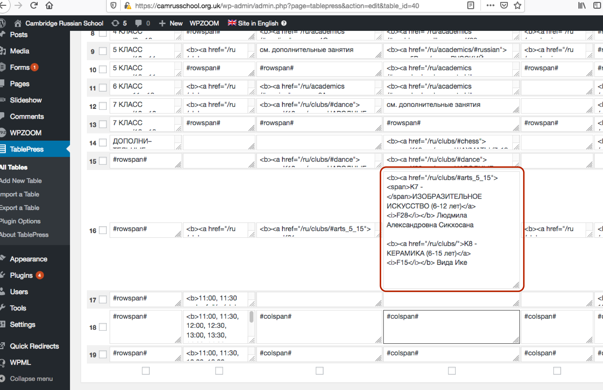

# Cambridge Russian School: How to make changes on the website

* Use your username and password to enter the WP admin panel: https://camrusschool.org.uk/wp-login.php

* The timetable-in-progress page is here: http://camrusschool.org.uk/timetable-2020-2021/ . Note: you do not need to edit this page. You only need to edit the tables (see below).

* The tables we are interested have the following ids: 
  + table id 39 (formerly 28)
  + table id 40 (formerly 29)
  + table id 41 (formerly 30)
  + table id 42 (formerly 31)

* The timetables can be accessed and edited at the following links:
  + [Дошкольное обучение (0-5 лет) 2020-21 учебный год](https://camrusschool.org.uk/wp-admin/admin.php?page=tablepress&action=edit&table_id=39)
  + [Начальная школа и средняя школа (5-13-лет) 2020-21 учебный год](https://camrusschool.org.uk/wp-admin/admin.php?page=tablepress&action=edit&table_id=40)
  + [Старшая-школа (13-17 лет) и взрослые 2020-21 учебный год](https://camrusschool.org.uk/wp-admin/admin.php?page=tablepress&action=edit&table_id=41)
  + [Расписание для взрослых (2020-21 учебный год)](https://camrusschool.org.uk/wp-admin/admin.php?page=tablepress&action=edit&table_id=42) (строки, отмеченные розовым цветом будут скрыты)

* При редактировании содержимого ячеек таблицы, следует пользоваться следующими правилами:

  + формат содержимого ячеек должен быть следующим: **`<b><a href="#"><span>K11 - </span>ОКРУЖАЮЩИЙ МИР</a><i>G7</i></b> Алёна Игоревна Самарова`**

  + Если в одной ячейке должна находиться информация о более, чем одном уроке, просто введите информацию о каждом уроке, нажимая Enter дважды - например,

```
<b><a href="#"><span>K7 - </span>ИЗОБРАЗИТЕЛЬНОЕ ИСКУССТВО (6-12 лет)</a><i>F28</i></b> Людмила Александровна Сикхосана

<b><a href="#">K8 - КЕРАМИКА (6-15 лет)</a><i>F15</i></b> Вида Ике
```
&nbsp;



&nbsp;


  + используйте `#rowspan#` для объединения с ячейкой предыдущей строки
  + используйте `#colspan#` для объединения с ячейкой предыдущеgo столбца
