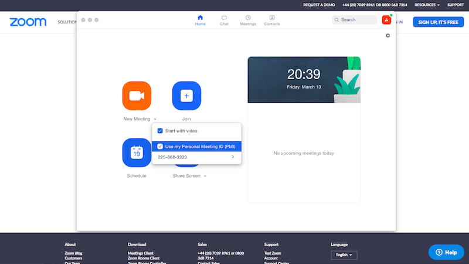
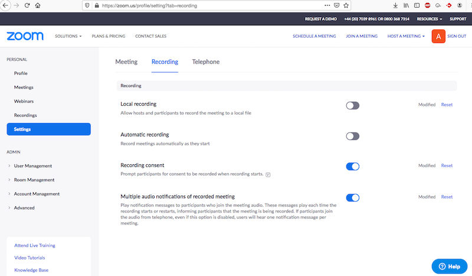

# Cambridge Russian School: using `ZOOM` for online lessons

## Instructions for Parents

* **in advance** (no later than 19 March 2020) download and install the client program ([https://zoom.us/download#client_4meeting](https://zoom.us/download#client_4meeting))
* in order to participate in an online lesson, start the installed client application `ZOOM`, click `Join` and type in the access code of the correct teacher that you received (the access code can also be entered in the browser at [https://zoom.us/join](https://zoom.us/join)). Note that the client application is still needed in order to participate in the lesson!

## Instructions for Teachers
* **in advance** (and no later than 18 March 2020) register on the site [https://zoom.us/signup](https://zoom.us/signup); note that *quick* registration using your `Google` or `Facebook` account is also possible
* **in advance** download and install the client program ([https://zoom.us/download#client_4meeting](https://zoom.us/download#client_4meeting))
* after installing `ZOOM` on your computer, copy your ID number as shown in the screenshot below and send it to the school administration by email (admissions@camrusschool.org.uk); You can also find your `Personal Meeting ID` by visiting the following page: [https://zoom.us/profile](https://zoom.us/profile)

&nbsp;

&nbsp;

* in the client program ZOOM click `New Meeting` -> `Use my Personal Meeting ID` as shown in the following screenshot

&nbsp;

&nbsp;

* (**IMPORTANT!**) video recording of lessons is prohibited, therefore, **in advance**, visit the settings page for video recording [https://zoom.us/profile/setting?tab=recording](https://zoom.us/profile/setting?tab=recording) and set these as follows: `Local recording -> OFF`,`Automatic recording -> OFF`, `Recording consent -> ON`, `Multiple audio notifications of recorded meeting - > ON`.
&nbsp;

&nbsp;

* in order to start an online lesson click ‘New Meeting’

* ZOOM offers an electronic board (`Whiteboard`), which can be used during your lesson; in order to enable this, click on `Share screen -> Whiteboard` (this function only works during the lesson)

* **When conducting online lessons, teachers should continue to fill in the attendance registers.**

We use Zoom  in a free mode, therefore the meeting may end automatically and without warning 40 minutes after the third participant had joined it. The teachers are therefore advised to conform to the following rules:
1. the teacher should not start the meeting long before the start of the lesson
2. the lesson starts from the moment the teacher is connected - you should not wait for "latecomers"
3. the teacher should keep track of time (ideally by using a timer / stopwatch) in order to finish the lesson in a courteous manner whenever possible.