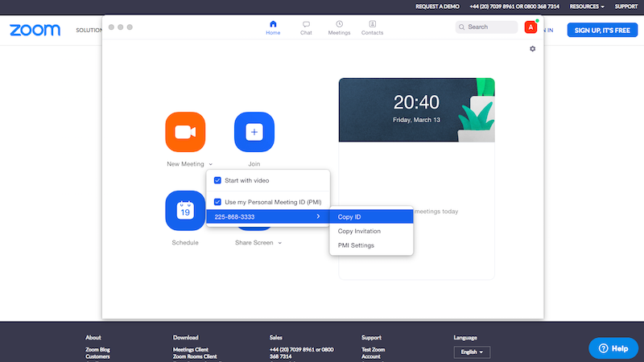

# Cambridge Russian School: using `ZOOM` for online lessons

## Instructions for Parents

* **in advance** (no later than 19 March 2020) download and install the client program ([https://zoom.us/download#client_4meeting](https://zoom.us/download#client_4meeting))
* in order to participate in an online lesson, start the installed client application `ZOOM`, click `Join` and type in the access code of the correct teacher that you received (the access code can also be entered in the browser at [https://zoom.us/join](https://zoom.us/join)). Note that the client application is still needed in order to participate in the lesson!

## Instructions for Teachers
* **in advance** (and no later than 18 March 2020) register on the site [https://zoom.us/signup](https://zoom.us/signup); note that *quick* registration using your `Google` or `Facebook` account is also possible
* **in advance** download and install the client program ([https://zoom.us/download#client_4meeting](https://zoom.us/download#client_4meeting))
* after installing `ZOOM` on your computer, copy your ID number as shown in the screenshot below and send it to the school administration by email (admissions@camrusschool.org.uk); you can also find your `Personal Meeting ID` by visiting the following page: [https://zoom.us/profile](https://zoom.us/profile)

&nbsp;

&nbsp;

* in the client program ZOOM click `New Meeting` -> `Use my Personal Meeting ID` as shown in the following screenshot

&nbsp;

&nbsp;

* (**IMPORTANT!**) video recording of lessons is prohibited, therefore, **in advance**, visit the settings page for video recording [https://zoom.us/profile/setting?tab=recording](https://zoom.us/profile/setting?tab=recording) and set these as follows: `Local recording -> OFF`,`Automatic recording -> OFF`, `Recording consent -> ON`, `Multiple audio notifications of recorded meeting - > ON`.
&nbsp;

&nbsp;

* **IMPORTANT!** On 4 April 2020 ZOOM introduced an obligatory use of passwords for all meetings on basic accounts, including the meetings that use Personal Meeting IDs. Even if you did not have to use passwords before for enabling access to your ZOOM meetings, you will have to start using it now, as ZOOM enforces it now. In order to find out the password that ZOOM assigned to your Personal Meeting ID by default and change it to the password you wish to use, do the following:: 

	1. use your internet browser and visit the following profile settings page: https://zoom.us/profile/setting (make sure you do that while being signed in to your ZOOM account, see https://zoom.us/signin)

	2. find Section `Require a password for Personal Meeting ID (PMI)` - this section is shown in the following screenshot:

	

	3. find your current password under the line `All meetings using PMI` - you can change the password now by pressing the button next to it:

	

	4. send your updated password to School Administration (admissions@camrusschool.org.uk or head@camrusschool.org.uk)

&nbsp;

* **WARNING!** The update made on April 4, 2020 introduces the use of waiting rooms by default! This means that parents, when trying to access your lesson (personal meeting), will first join the waiting room and will only be able to join the lesson if you explicitly admit them. ZOOM will show you who joined the waiting room and will offer you to either block or admit your meeting guests. The teachers must be aware of this behaviour of the application and act correspondingly. The use of the waiting room is optional and can  be disables as follows:

	1. visit https://zoom.us/profile/setting (make sure you are signed in, see https://zoom.us/signin)

	2. find Section `Waiting room` - this section is shown in the following screenshot:

	

	3. use the selector and disable the use of the waiting room.

	**The rule is straightforward - when the waiting room is *enabled*, the teachers need to bear in mind that parents will not be able to leave the waiting woom and join the lesson until they are explicitly admitted to it by the teacher (i.e. meeting host). If the use of the waiting room is *disabled*, parents will be able to join the lesson without having to join the meeting room and wait for your permission to join the lesson.**

&nbsp;

* in order to start an online lesson click ‘New Meeting’

* ZOOM offers an electronic board (`Whiteboard`), which can be used during your lesson; in order to enable this, click on `Share screen -> Whiteboard` (this function only works during the lesson)

* **When conducting online lessons, teachers should continue to fill in the attendance registers.**

We use Zoom  in a free mode, therefore the meeting may end automatically and without warning 40 minutes after the third participant had joined it. The teachers are therefore advised to conform to the following rules:
1. the teacher should not start the meeting long before the start of the lesson
2. the lesson starts from the moment the teacher is connected - you should not wait for "latecomers"
3. the teacher should keep track of time (it is possible to enable a timer in ZOOM - see details below) in order to finish the lesson in a courteous manner whenever possible.

* In order to enable a timer that is showing meeting's duration click on the avatar/icon i nthe upper right corner of the application and choose `Settings` and then `General`; tick `Show my meeting duration` as shown below:

&nbsp;

&nbsp;

* In order to share your screen or play a video during the call/lesson, use the button `Share Screen` of ZOOM's control panel at the bottom of the application screen. As shown in the screenshot below, do make sure that `Share computer sound` is ticked when you choose a screen to share in order to enable the audio as well (if `Share computer sound` is not selected, the participants will be able to see the video **without** any sound):

&nbsp;

* In order to disable other participants to draw on the whiteboard you may be sharing, make sure that Annotation from ZOOM's settings is turned OFF. Specifically, visit `https://zoom.us/profile/setting` and click on `In Meeting (Basic)`, then find `Annotation` and make sure that it is disabled, as shown below:

&nbsp;

&nbsp;

# Useful links
 * [Scheduling meetings in ZOOM](https://support.zoom.us/hc/en-us/articles/201362413-Scheduling-meetings)
 * [How to use ZOOM for online learning](https://blog.zoom.us/wordpress/2020/03/13/how-to-use-zoom-for-online-learning/)
 * [How to share video and audio in ZOOM](https://www.youtube.com/watch?v=-8XQa7YGcmM)