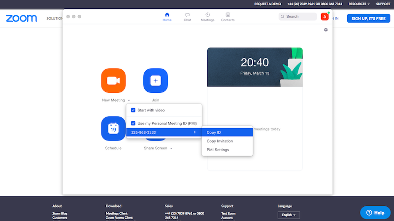
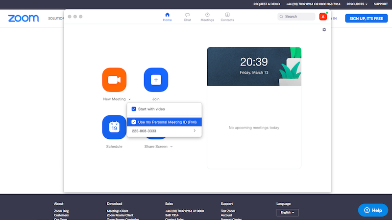
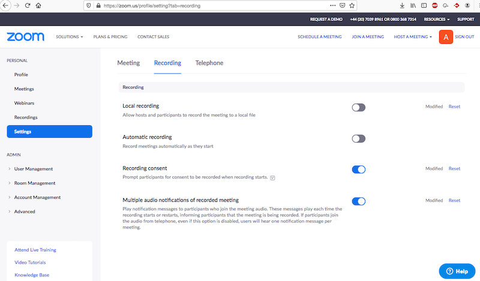

# Кембриджская Русская Школа: использование `ZOOM` для online уроков

## Инструкции для родителей

* **заранее** скачайте и установите программу клиент ([https://zoom.us/download#client_4meeting](https://zoom.us/download#client_4meeting))
* для участия в уроке запустите установленную программу-клиент `ZOOM`, нажмите `Join` и введите код доступа нужного учителя, полученный администрацией (код доступа можно ввести и в браузере по адресу [https://zoom.us/join](https://zoom.us/join), но программа-клиент все равно понадобиться для участия в уроке!)

## Инструкции для учителей

* **заранее** зарегистрируйтесь на сайте [https://zoom.us/signup](https://zoom.us/signup); обратите внимание, что возможна быстрая регистрация с использованием вашей учетной записи в `Google` или `Facebook`
* **заранее** скачайте и установите программу клиент ([https://zoom.us/download#client_4meeting](https://zoom.us/download#client_4meeting))
* после установки `ZOOM`'a на своем компьютере скопируйте свой ID номер как указано на скриншоте внизу и вышлите его администрации школы на email admissions@camrusschool.org.uk; `Personal Meeting ID` можно также узнать посетив следующую страницу: [https://zoom.us/profile](https://zoom.us/profile)

&nbsp;

&nbsp;

* в программе-клиенте `ZOOM` нажмите `New Meeting` -> `Use my Personal Meeting ID` как показано на следующем скриншоте

&nbsp;

&nbsp;

* (**ВАЖНО!**) запись видео-уроков запрещена, поэтому  **заранее** посетите страницу с настройками для видео записи [https://zoom.us/profile/setting?tab=recording](https://zoom.us/profile/setting?tab=recording) и установите их следующим образом: `Local recording -> OFF`, `Automatic recording -> OFF`, `Recording consent -> ON`, `Multiple audio notifications of recorded meeting -> ON`

&nbsp;

&nbsp;

* чтобы начать online урок нажмите New Meeting 

* в программе ZOOM имеется электронная доска (`Whiteboard`), которую можно использовать во время урока; для этого нажмите `Share screen -> Whiteboard` (эта функция работает только во время урока)

Мы пользуемся `Zoom`'om в бесплатном режиме, поэтому встреча заканчивается автоматически и без предупреждения через 40 минут с момента соединения третьего участника. Это означает что учитель должен соблюдать следующие правила:
1. учитель не должен начинать встречу задолго до начала урока
2. урок начинается с момента подключения учителя - ждать "опоздавших" не следует
3. учитель должен следить за временем (в идеале таймер/секундомер), чтобы по возможности завершить урок в "контролируемом режиме".