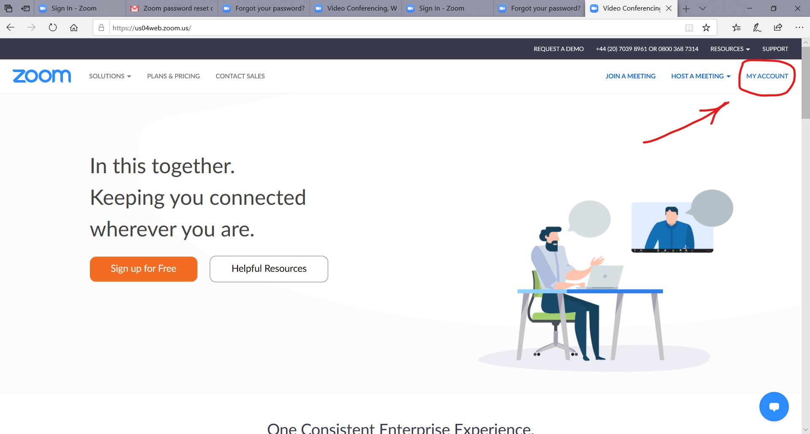
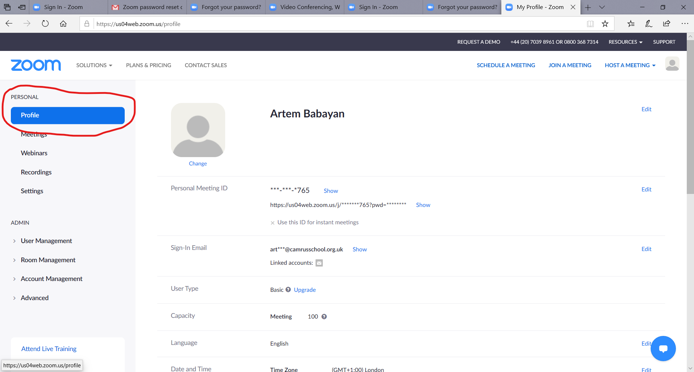
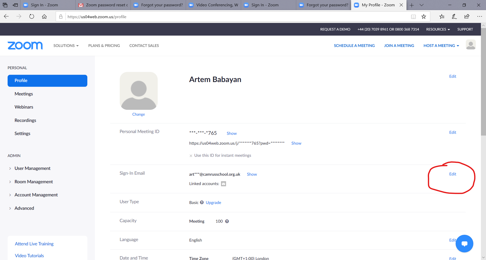
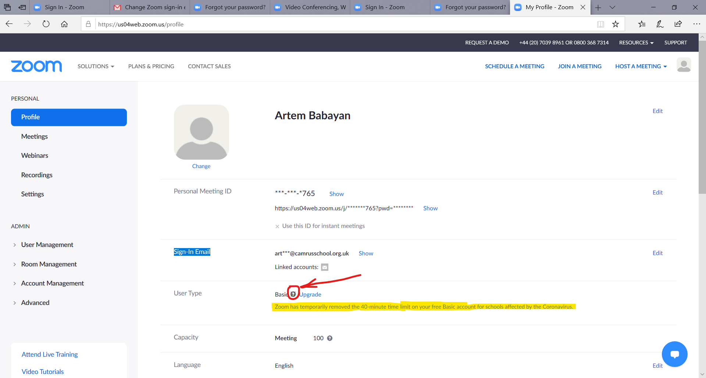
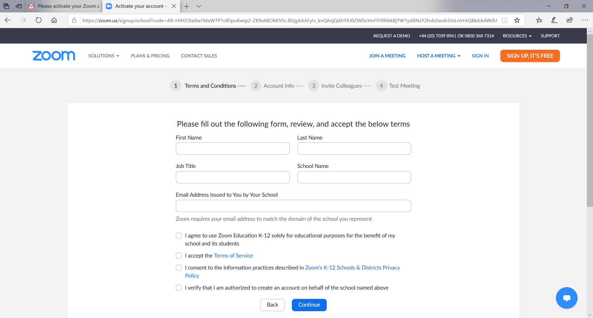

# Снятие лимита в 40 минут для бесплатных Zoom-аккаунтов.

Cambridge Russian School зарегистрировалась в Zoom как образовательное учреждение. Это позволило временно, на период карантина, убрать лимит в 40 минут для бесплатных аккаунтов, зарегистрированных на официальные школьные e-mail адреса. Таким образом, для проведения непрерывных 45-минутных уроков с использованием уже существующего бесплатного Zoom-аккаунта учителям необходимо изменить e-mail адрес для этого аккаунта. В этом случае: 

* номер Zoom-кабинета не меняется
* лимит в 40 минут снимается сразу.

Если, по какой-то причине, учитель не желает (не может) сменить зарегистрировавнный e-mail адрес, необходимо завести **новый Zoom-аккаунт** с использованием школьного e-mail адреса. В этом случае

* учитель получит **новый** номер zoom-кабинета, который необходимо сообщить администрации
* дальнейшие on-line уроки должны проводиться с использованием нового zoom-кабинета.

## Смена e-mail для существующего zoom-аккаунта.

Это вариант **рекомендованный** школой, поскольку позволит снять 40-минутный лимит на уроки без необходимости уведомления родителей о новом номере zoom-кабинета учителя.

1. Войдите (sign-in) в свой zoom-аккаунт на [zoom.us](http://zoom.us) и перейдите в раздел My account (правый верхний угол): 

&nbsp;

&nbsp;

2. Далее в раздел Personal->Profile

&nbsp;

&nbsp;

3. Затем щёлкните на Edit напротив "Sign-In Email"

&nbsp;

&nbsp;

4. Появятся поля ввода, в которых вас попросят указать новый e-mail **(укажите здесь ваш школьный e-mail: `name.surname@camrusschool.org.uk)`** и подтвердить пароль.

&nbsp;

&nbsp;

5. На ваш **новый школьный e-mail** придёт письмо "Change Zoom sign-in email address" -- щёлкните на "Confirm change"

6. Вас попросят сменить пароль.

7. Снова войдите в свой аккаунт в раздел Personal->Profile и в поле User Type нажмите на знак '?' возле слова 'Basic' -- должно появиться уведомление, что лимит на 40 минут для вашего аккаунта временно снят.

&nbsp;

&nbsp;

8. Ура, всё получилось! 

## Регистрация нового zoom-аккаунта с использованием школьного e-mail адреса.

Используйте это вариант только если вы по каким-то причинам не желаете (не можете) изменить e-mail в zoom-аккаунте уже используемом для проведения занятий.

[Следуйте этим инструкциям](https://github.com/mathmusci/camrusschool-covid-19-contingency/blob/master/zoom-edmodo-instructions.md), указав при регистрации новый школьный e-mail адрес. Zoom должен автоматически определить, что этот адрес принадлежит школе и попросит вас ответить на несколько вопросов:

&nbsp;

&nbsp;

&nbsp;

&nbsp;

* **(ВАЖНО!)** вам необходимо **заново** установить все настройки, как указано [в инструкциях](https://github.com/mathmusci/camrusschool-covid-19-contingency/blob/master/zoom-edmodo-instructions.md)
* Как можно быстрее сообщите новый номер zoom-кабинета **и пароль** администрации.

Поскольку при новой регистрации меняется номер zoom-кабинета учителя, вы не можете использовать его для проведения занятий пока администрация не уведомит всех родителей / внесёт соответствующие изменения в расписание.
