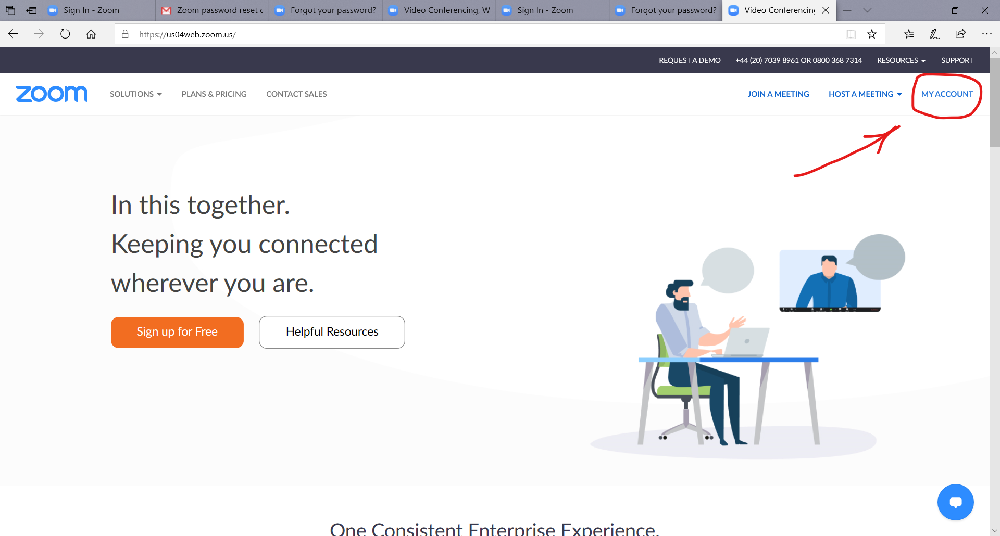
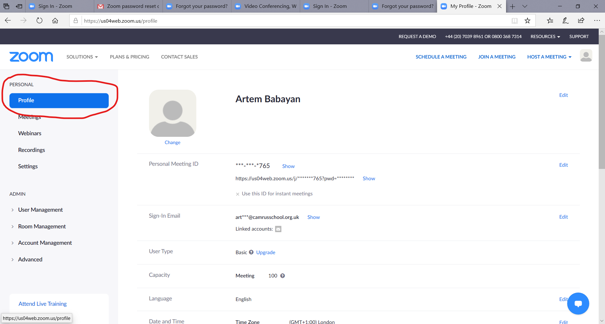
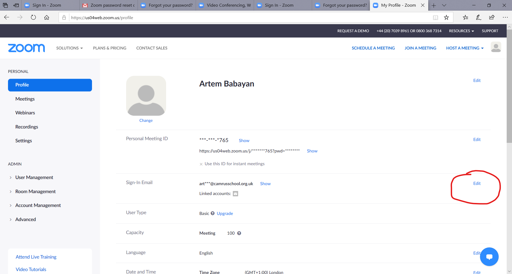
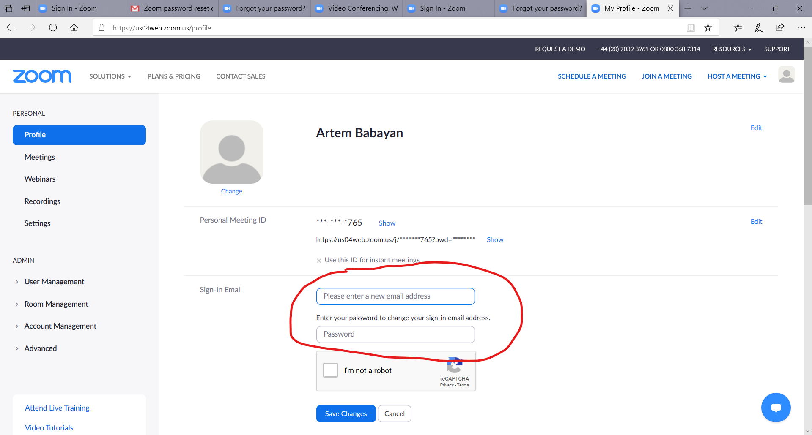
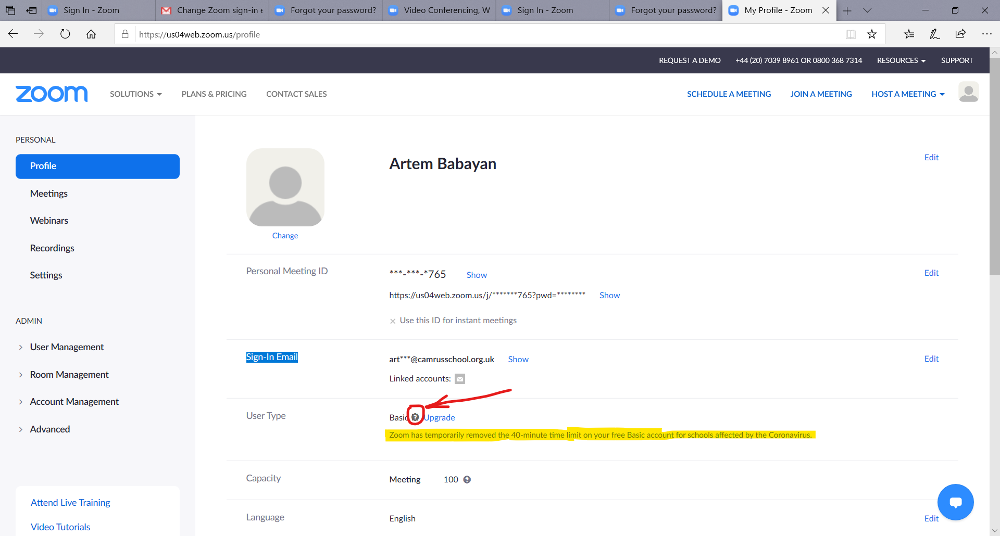
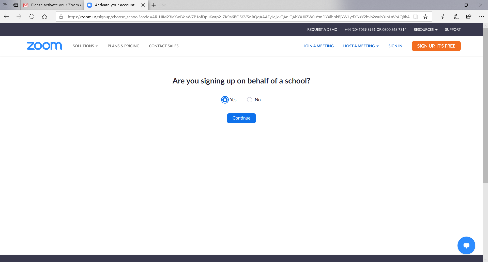
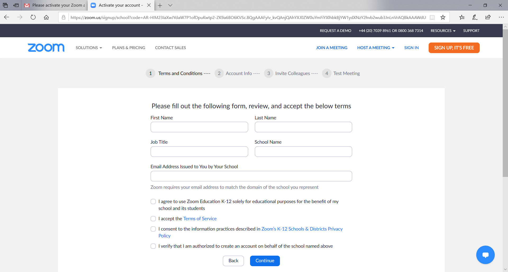

# Lifting the 40-minutes limit from basic Zoom-accounts.

Cambridge Russian School is now registered with Zoom as provider of education. This allows us temporary, for the duration of the lockdown, to lift the 40 minutes limit for basic accounts, registered with official school's email addresses. Therefore, in order to conduct uninterrupted 45-minutes lessons using existing Zoom-acccounts teachers have to replace e-mail address for this account. In this case: 

* number of Zoom meeting room remains the same;
* 40 minutes limit gets removed straight away.

If, for some reasons, teacher cannot change the registered e-mail addres in existing Zoom-account, he or she has to open **new Zoom account** using official school address. In this case:

* teacher will get new Zoom meeting room with the **new number** which must be given to school administration,
* it will be necessary **to adjust account settings** according to [guide](https://github.com/mathmusci/camrusschool-covid-19-contingency/blob/master/zoom-edmodo-instructions_en.md),
* on-line lessons should be conducted using the new Zoom meeting room.

## Changing e-mail for existing Zoom-account.

This options **is recommended** by school, as the it allows removing the 40 minutes lesson duration limit with minimal discruption to existing setup, with no need to notify all parents about new Zoom number.

1. Sign in to your zoom-account [zoom.us](http://zoom.us) and go to My account: 

&nbsp;

&nbsp;

2. Then go to Personal->Profile

&nbsp;

&nbsp;

3. Then click Edit accross "Sign-In Email" field

&nbsp;

&nbsp;

4. You will be asked to enter your new email **(provide your school e-mail: `name.surname@camrusschool.org.uk)`** and confirm your zoom-account password.

&nbsp;

&nbsp;

5. Your **new school e-mail** should receve letter "Change Zoom sign-in email address" -- click "Confirm change"

6. You will be asked to change password.

7. Again sign it to your zoom-account using your new credentials, go to Personal->Profile and click sign '?' near the word 'Basic' in User Type field -- you should see notification that your 40-minutes limit is temporary removed.

&nbsp;

&nbsp;

8. Hoooray! You did it!

## Creating new Zoom account with new school e-mail.

Use this option only if you cannot change e-mail in Zoom account you already use for online lesson.

[Follow this guide](https://github.com/mathmusci/camrusschool-covid-19-contingency/blob/master/zoom-edmodo-instructions_en.md), specifying your new school email. Zoom should recognize automatically your email as official school email and will ask you to fill the following form:

&nbsp;

&nbsp;

&nbsp;

&nbsp;

* **(IMPORTANT!)** you must **adjust settings for your new account** according [this guide](https://github.com/mathmusci/camrusschool-covid-19-contingency/blob/master/zoom-edmodo-instructions_en.md)
* please, send the Zoom meeting room number **and its password** (NOT password for your Zoom account, just the password for your meeting room) to administration as soon as possible.

Because in this case the teacher's Zoom meeting room will change, you cannot start using your new zoom account for lessons until school administration notifies all parents about the change.
